# Douglas Kitchens & Bathrooms

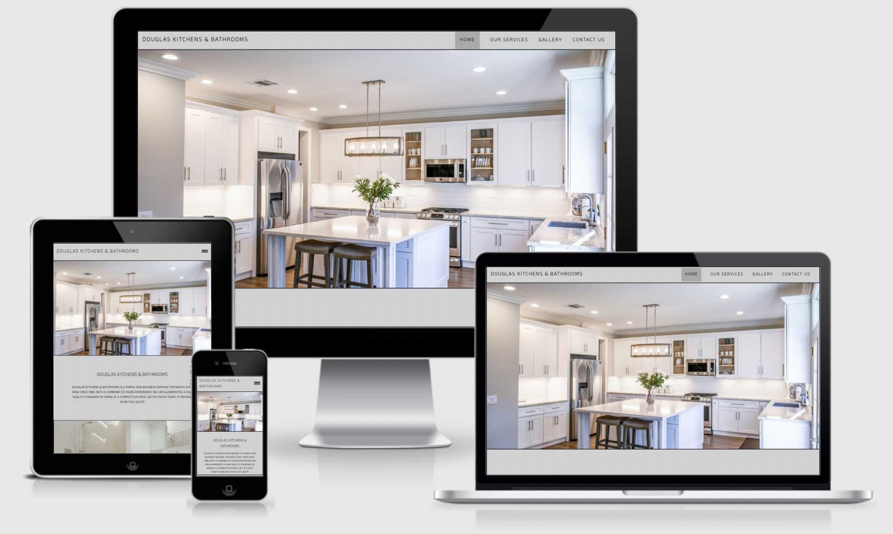

[Visit the webpage](https://jburto93.github.io/CI_PP1_DKB/)  
Developer - Jonathan Burton

1. [Project Goals](#project-goals)
    1. [User Goals](#user-goals)
    2. [Site Owner Goals](#site-owner-goals)
2. [User Experience](#user-experience)
    1. [Target Audience](#target-audience)
    2. [User Requirements and Expectations](#user-requrements-and-expectations)
    3. [User Stories](#user-stories)
3. [Design](#design)
    1. [Design Choices](#design-choices)
    2. [Colours](#colours)
    3. [Fonts](#fonts)
    4. [Structure](#structure)
    5. [Wireframes](#wireframes)
4. [Technologies Used](#technologies-used)
    1. [Languages](#languages)
    2. [Frameworks & Tools](#frameworks-&-tools)
5. [Features](#features)
6. [Testing](#validation)
    1. [HTML Validation](#HTML-validation)
    2. [CSS Validation](#CSS-validation)
    3. [Accessibility](#accessibility)
    4. [Performance](#performance)
    5. [Device testing](#performing-tests-on-various-devices)
    6. [Browser compatibility](#browser-compatability)
    7. [Testing user stories](#testing-user-stories)
8. [Bugs](#Bugs)
9. [Deployment](#deployment)
10. [Credits](#credits)
11. [Acknowledgements](#acknowledgements)

## Project Goals 

### User Goals
- Find a company who installs kitchens and/or bathrooms.
- See the different range of kitchens and bathrooms.
- See the quality of of work the company produce.
- Find company contact details
- Find company location

### Site Owner Goals
- Promote the company.
- Increase the sales of the company.
- Provide a way for customers to see what the company does/produces.
- Provide a way for the customers to see the companys standard of work.
- Provide a way for customers to contact the company.

## User Experience

### Target Audience
- People who are wanting a new kitchen.
- People who are wanting a new bathroom.
- People who own a house.

### User Requirements and Expectations

- Consistancy in the site so the customer quickly gets used to the site.
- A simple way to navigate around the site.
- To easily be able to find the information they are looking for.
- An eye catching site / design on different device screen sizes.
- Easy to read content.
- Easily accessible site.
- All links and functions to work as expected.
- To find the company contact details.
- To find the company location.

### User Stories

#### First time User 
1. As a first time user, I want to see the variety of kitchens the company offer.
2. As a first time user, I want to see the variety of bathrooms the company offer.
3. As a first time user, I want to see the standard of work the company produce.
4. As a first time user, I want to know how to contact the company.
5. As a first time user, I want to know where the company is located.

#### Returning User
6. As a returning user, I want to see the new kitchen styles the company offer.
7. As a returning user, I want to see the new bathroom styles the company offer.
8. As a returning user, I want to find the company contact number to call for any issues.
9. As a returning user, I want to leave a review following recent work completed by the company.
10. As a returning user, I want to find the companies social media pages.

#### Site Owner 
11. As the site owner, I want the customer to learn about the company.
12. As the site owner, I want the customer to see what we offer.
13. As the site owner, I want the customers to know where we are located.
14. As the site owner, I want the customers to be able to contact us.
15. As the site owner, I want the customers to be able to give us feedback on our work.

## Design

### Design Choices
The website was designed to look modern and stylish while keeping the site simple to naviagte for the customer, the design replicates the companies sleek kitchen and bathroom designs they offer. 

### Colour
The monochromatic colour scheme of black, white and different shades of grey was chosen to give a modern look to the webpage. The darker colouring also allows the images of the companies installed work really stand out. When choosing the site colours I used Adobe Color to confirm the contrast between the colours was right.

### Fonts
The heading font chosen for throughout the site is anek telugu from Google Fonts, the reasons I chose this font is because it is very clear and easy to read. The chosen font also has a stylish modern look which links in with the design of the webpage. As a back up I chose sans-serif if the anek telugu is unavailable.

### Structure
The webpage has been structured in a familiar and accessible way. Once the user has reached the site they will instantly see the company name/logo in the top left corner and the navitgation menu in the top right corner, this is common throughout the site to keep the site easily operated by the user. The site is made up of four pages:
- Homepage has two sections, firstly a brief introduction to the company and secondly reasons why to choose the company.
- Our Services outlines the servies the company offer.
- Gallery shows the user an image gallery of all recent work completed by the company.
- Contact Us provides all contact information for the company and a form allowing the user to contact the company.

### Wireframes

Home

Home - Mobile

Our Services

Our Services - Mobile

Gallery

Gallery - Mobile

Contact Us

Contact Us - Mobile

## Technologies Used

### Languages
- HTML 5
- CSS 3

### Frameworks & Tools
- Git
- Gitpod
- Github
- Wireframe.cc
- Google Fonts
- Font Awsome
- Adobe Color
- Adobe Photoshop
- Google Maps
- Photo Resizer

## Features
The webpage is made up of eleven features across four pages.

### Features located on all pages
#### Navigation Bar

- The Navigation bar is consistant across all four pages.
- The design makes it very simple for users to navigate around thr webpage.
- The navigation bar is reponsive to all device screen sizes and the design changes to include a hamburger icon on screens under 950px to keep navigation easy on smaller devices.
- On devices above 950px webpages will change colour to white when the user hovers over them.
- The current page the user is on will be highlighted with grey box around page name.

#### Footer

- The Footer is consistant across all four pages.
- The user can navigate to other pages using the quick links section of the footer.
- The user can find all company contact informtion using the contact us section of the footer.
- The user can visit the company social media pages using the icon links in the footer.
- On devices above 950px all links in the footer will change colour to white when the user hovers over them.

#### User stories covered by the Footer
- 4. As a first time user, I want to know how to contact the company.
- 5. As a first time user, I want to know where the company is located. 
- 8. As a returning user, I want to find the company contact number to call for any issues.
- 10. As a returning user, I want to find the companies social media pages.
- 13. As the site owner, I want the customers to know where we are located.
- 14. As the site owner, I want the customers to be able to contact us.

### Homepage Features
### Hero Image

- The homepage hero is an image of a kitchen installation completed by the company, the image is eye catching and gives the user a quick glimpse into the company.
- The homepage hero is responsive on all device screen sizes.

#### User stories covered by the Hero Image
- 3. As a first time user, I want to see the standard of work the company produce.
- 12. As the site owner, I want the customer to see what we offer.

### About Us section

- This feature gives the user a brief insight into the company history.
- The text and image are reponsive on all device screens.

#### User stories covered by the About Us section
- 3. As a first time user, I want to see the standard of work the company produce.
- 11. As the site owner, I want the customer to learn about the company.

### Why Choose Us section

- This feature gives the user more information about the company and reasons to choose them.
- The text and image are reponsive on all device screens.

#### User stories covered by the Why Choose Us section
- 3. As a first time user, I want to see the standard of work the company produce.
- 11. As the site owner, I want the customer to learn about the company.

### Our Services Features
#### Kitchen Installations

- This feature give the user information aboout the companies kitchen installations.
- The contact us button is a link to the contact us page where the user can contact the company.
- The images show kitchen installations completed by the company.

#### User stories covered by the Kitchen Installations section
- 1. As a first time user, I want to see the variety of kitchens the company offer.
- 3. As a first time user, I want to see the standard of work the company produce.
- 12. As the site owner, I want the customer to see what we offer.

#### Bathroom Installations
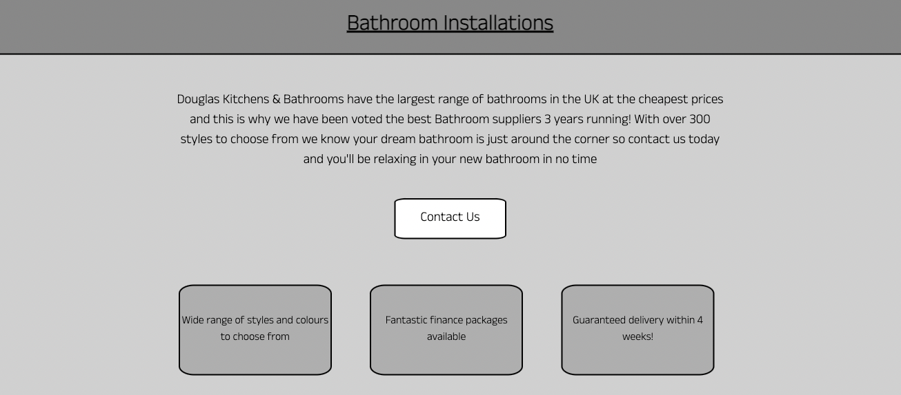
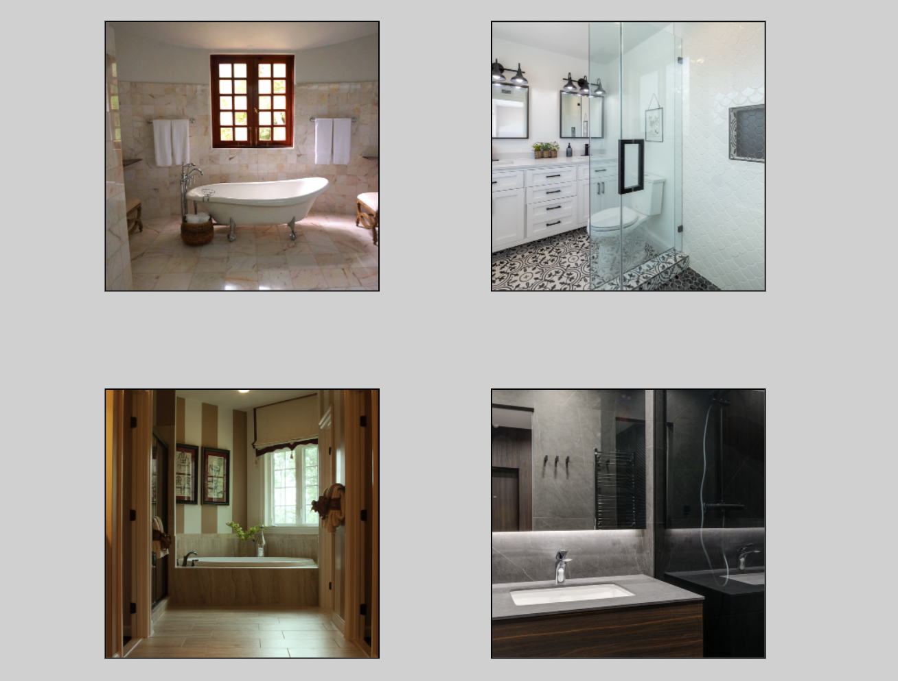
- This feature give the user information aboout the companies bathroom installations.
- The contact us button is a link to the contact us page where the user can contact the company.
- The images show bathroom installations completed by the company.

#### User stories covered by the Bathroom Installations section
- 2. As a first time user, I want to see the variety of bathrooms the company offer.
- 3. As a first time user, I want to see the standard of work the company produce.
- 12. As the site owner, I want the customer to see what we offer.

#### Customer Review Carousel
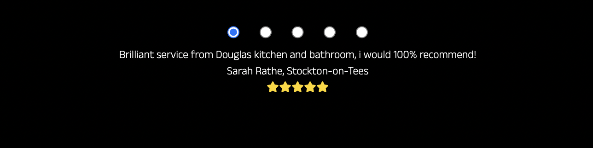
- This feature shows the user reviews left by recent customers who have had work completed by the company.
- User can move to the next review by clicking the circle icons.

#### User stories covered by the Customer Review Carousel
- 3. As a first time user, I want to see the standard of work the company produce.

### Gallery Features
#### Gallery Images
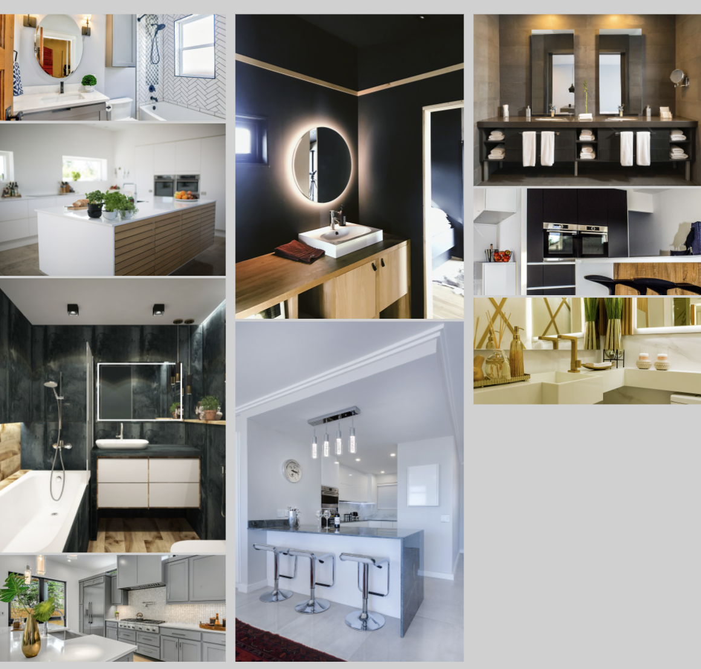
- This feature shows new customers a variety of different installations by the company.
- This feature gives existing customers a variety of different installations by the company.
- Images are in a masonry design style.

#### User stories covered by the Gallery Images
- 1. As a first time user, I want to see the variety of kitchens the company offer.
- 2. As a first time user, I want to see the variety of bathrooms the company offer.
- 3. As a first time user, I want to see the standard of work the company produce.
- 6. As a returning user, I want to see the new kitchen styles the company offer.
- 7. As a returning user, I want to see the new bathroom styles the company offer.
- 12. As the site owner, I want the customer to see what we offer.

### Contact Us Features
#### Contact Form
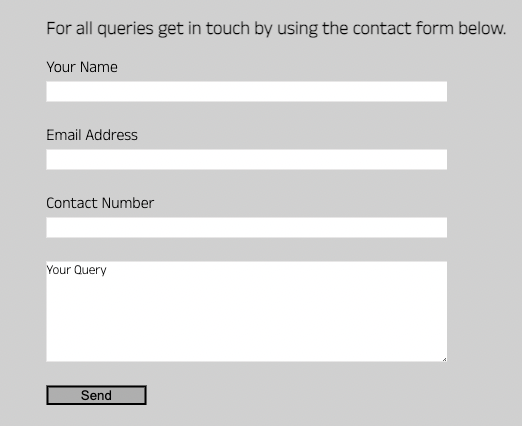
- This feature gives the user an opportunity to contact the company with any query.
- This feature gives the user an opportunity to leave a review.

#### User stories covered by the Contact Us Form
- 4. As a first time user, I want to know how to contact the company.
- 9. As a returning user, I want to leave a review following recent work completed by the company.
- 14. As the site owner, I want the customers to be able to contact us.
- 15. As the site owner, I want the customers to be able to give us feedback on our work.

#### Map
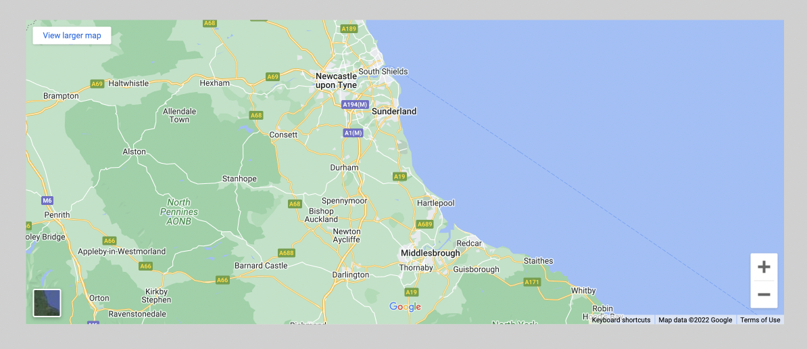
- This feature shows the user where the company is located (please note no specific location has been selected on the map as company has been created for the purpose of this project).

#### User stories covered by the Map
- 5. As a first time user, I want to know where the company is located.
- 13. As the site owner, I want the customers to know where we are located.

### Performing tests on various devices 
The website was tested on the following devices:
- Lenovo Yoga 2 Pro (both in pc and tablet mode)
- Honor 20 pro
- Xiaomi Redmi Note 7

Also the webpage has been tested using all the devices available on the Google Chrome Developer Tools.

### Browser compatability
This webpage has been tested on the following browsers:
- Google Chrome
- Safari
- Mozilla Firefox

### Testing user stories

1. As a first time user, I want to see the variety of kitchens the company offer.

| **Feature** | **Action** | **Expected Result** | **Actual Result** |
|-------------|------------|---------------------|-------------------|
| Kitchen Installations | Navigate to the Our Services page and see the top section about the companies kichen installations | User finds information on the kitchens the company offer | Works as expected |
| Gallery Images | Navigate to the Gallery page and look through the images of recently completed work | See a variety of kitchen installs | Works as expected |

Screenshots

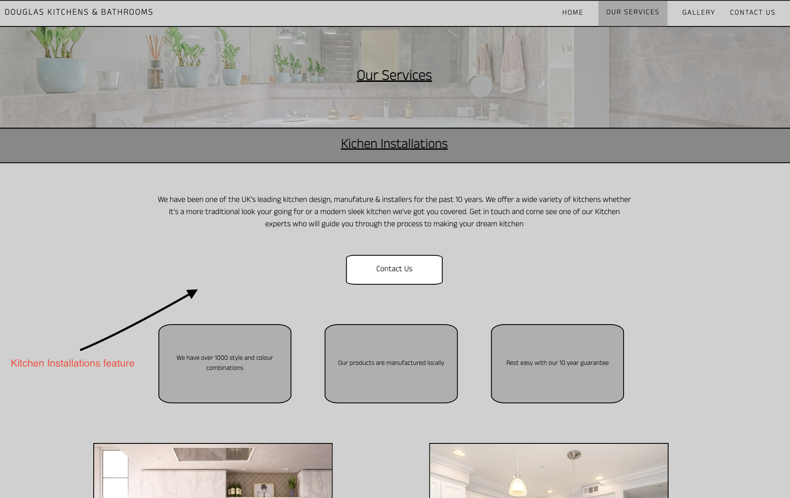
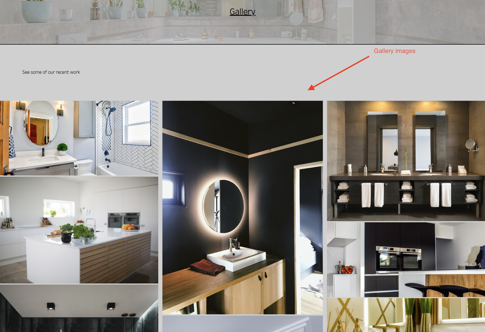

2. As a first time user, I want to see the variety of bathrooms the company offer.

| **Feature** | **Action** | **Expected Result** | **Actual Result** |
|-------------|------------|---------------------|-------------------|
| Bathroom Installations | Navigate to the Our Services page and see the bottom section about the companies bathroom installations | User finds information on the bathrooms the company offer | Works as expected |
| Gallery Images | Navigate to the Gallery page and look through the images of recently completed work | See a variety of bathroom installs | Works as expected |

Screenshots

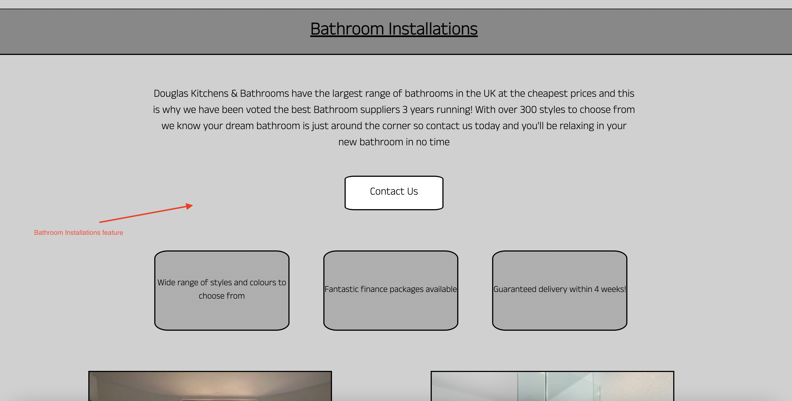

3. As a first time user, I want to see the standard of work the company produce.

| **Feature** | **Action** | **Expected Result** | **Actual Result** |
|-------------|------------|---------------------|-------------------|
| Hero Image | Open the webpage this is the first image the user will see | User sees an installation completed by the company | Works as expected |
| About Us | Scroll down the Home page to the about us section and see the image of recently completed work | User sees an installation completed by the company | Works as expected |
| Why Choose Us | Scroll down the Home page to the why choose us section and see the image of recently completed work | User sees an installation completed by the company | Works as expected |
| Kitchen Installations | Navigate to the Our Services page and see the top section about the companies kitchen installations |  User sees an installation completed by the company | Works as expected |
| Bathroom Installations | Navigate to the Our Services page and see the bottom section about the companies bathroom installations |  User sees an installation completed by the company | Works as expected |
| Gallery Images | Navigate to the Gallery page and see the companies installations |  User sees an installation completed by the company | Works as expected |
| Customer Review Carousel | Navigate to the Our Servies page and see reviews left by customers |  User sees what prevoius customers think of the work | Works as expected |

Screenshots

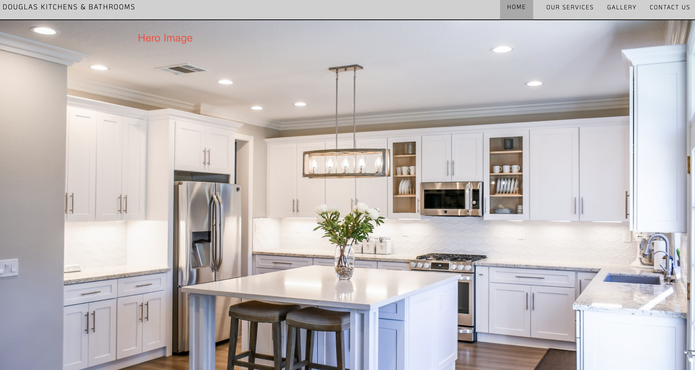
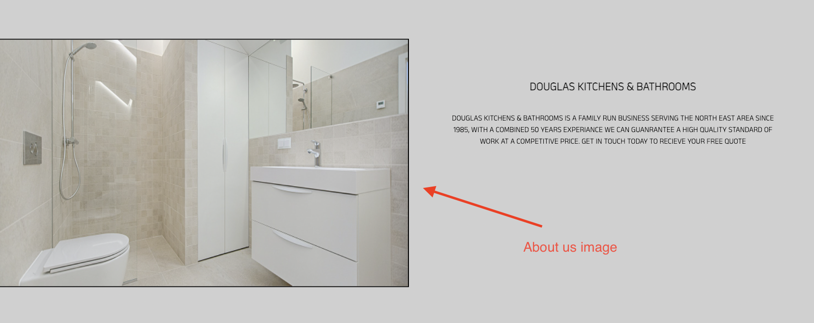
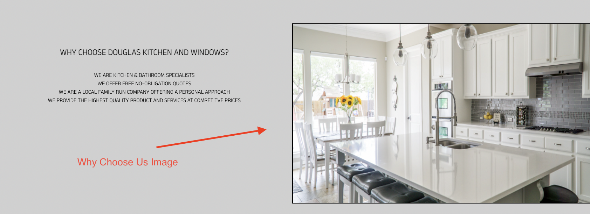
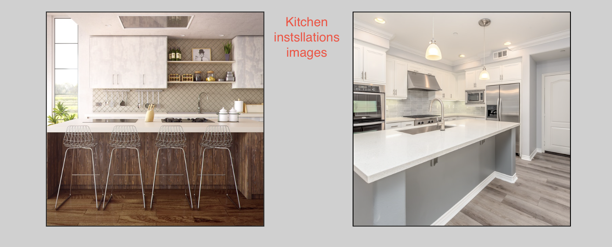
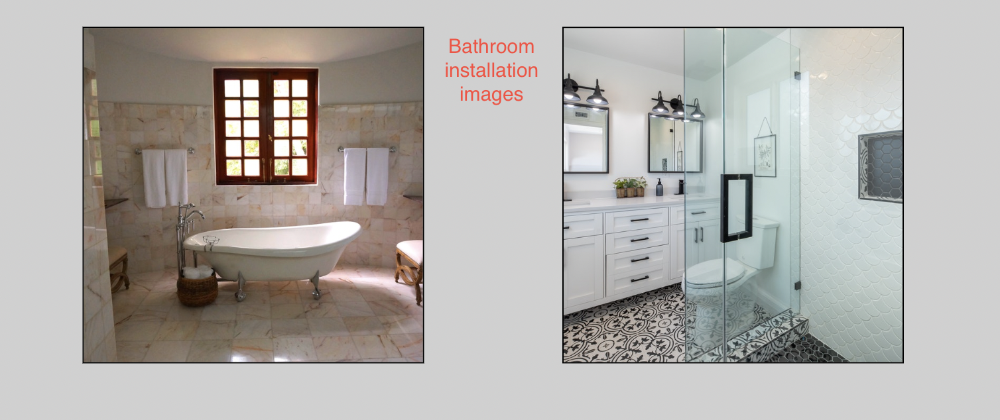

4. As a first time user, I want to know how to contact the company.

| **Feature** | **Action** | **Expected Result** | **Actual Result** |
|-------------|------------|---------------------|-------------------|
| Footer | Open any page on the website and scroll to the bottom of the page | User will see contact information for the company | Works as expected |
| Contact Us Form | Navigate to the Contact Us page, form is located at the top of the page, user can submit a message to contact the company | User can send message to company | Works as expected |

Screenshots

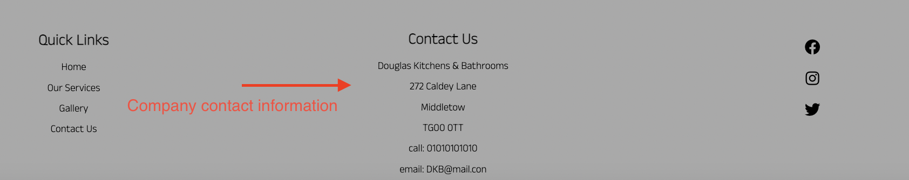
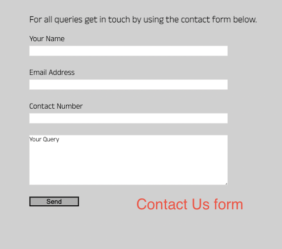

5. As a first time user, I want to know where the company is located.

| **Feature** | **Action** | **Expected Result** | **Actual Result** |
|-------------|------------|---------------------|-------------------|
| Footer | Open any page on the website and scroll to the bottom of the page | User will see contact information for the company | Works as expected |
| Map | Navigate to the Contact Us page, map is located at the bottom of the page | User can see exactly where company is located | Works as expected |

Screenshots

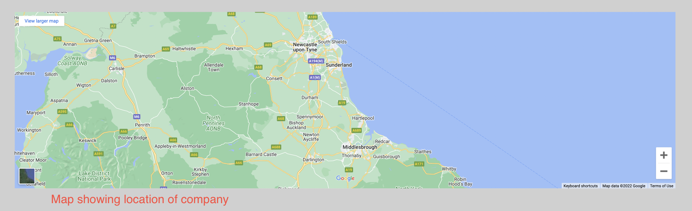

6. As a returning user, I want to see the new kitchen styles the company offer.

| **Feature** | **Action** | **Expected Result** | **Actual Result** |
|-------------|------------|---------------------|-------------------|
| Gallery Images | Navigate to the Gallery page and see the companies recent installations |  User sees recent installations completed by the company | Works as expected |

Screenshots

7. As a returning user, I want to see the new bathroom styles the company offer.

| **Feature** | **Action** | **Expected Result** | **Actual Result** |
|-------------|------------|---------------------|-------------------|
| Gallery Images | Navigate to the Gallery page and see the companies recent installations |  User sees recent installations completed by the company | Works as expected |

Screenshots

8. As a returning user, I want to find the company contact number to call for any issues.

| **Feature** | **Action** | **Expected Result** | **Actual Result** |
|-------------|------------|---------------------|-------------------|
| Footer | Open any page on the website and scroll to the bottom of the page | User will see contact information for the company | Works as expected |

Screenshots

9. As a returning user, I want to leave a review following recent work completed by the company.

| **Feature** | **Action** | **Expected Result** | **Actual Result** |
|-------------|------------|---------------------|-------------------|
| Contact Us Form | Navigate to the Contact Us page, form is located at the top of the page | User can send review message to company | Works as expected |

Screenshots

10. As a returning user, I want to find the companies social media pages.

| **Feature** | **Action** | **Expected Result** | **Actual Result** |
|-------------|------------|---------------------|-------------------|
| Footer | Open any page on the website and scroll to the bottom of the page | User will see social media icon links for the company | Works as expected |

Screenshots

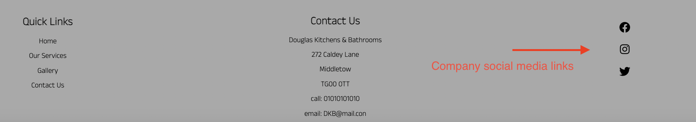

11. As the site owner, I want the customer to learn about the company.
12. As the site owner, I want the customer to see what we offer.
13. As the site owner, I want the customers to know where we are located.
14. As the site owner, I want the customers to be able to contact us.
15. As the site owner, I want the customers to be able to give us feedback on our work.

## Bugs

|**Bug**|**Fix**|
|---------|---------|
| Responsive hamburger icon button scrolls down the page as the user scrolls. | Alter the position of the icon to sticky |
| Mobile drop down menu would open half way down the webpage hamburger | Alter the CSS to give the menu a fixed positon using PX and not a responsive unit |
| All page links in the naivgation bar were highligted at once. | Alter the HTML changing the current class to the correct page |
| Text 'Your Query' does not clear in the contact form input field when it is clicked. | Add the css - onfocus="this.value=''" |
| CSS from the customer review carousel was intefiering with the contact form | Add the class name as well as the input element in CSS file to make the target more specific |
| When viewing the site on mobile devices there was a large white space to the left of the webpage.  | Add overflow-x - hidden to the html, body element |

## Deployment
This webpage was deployed using GitHub pages, this is how I did it.
This website has been deployed using GitHub pages. To do the same...
1. Log into your GitHub account and locate the settings tab.
2. Click on 'settings'.
3. Find the 'pages' tab on the LHS.
4. Click 'source' and from the drop dowm box select 'Main - Branch'
5. Wait while the webpage automatically refreshes. 
6. Find the 'pages' tab again where the link to your webpage will be located.

You can fork the repository, this is how I did it.
1. Navigate to the GitHub repository.
2. Locate and click the fork button in the top right hand corner of the screen.
3. This will create a copy in your GitHub account.

You can make a local clone, this is how I did it.
1. Log into your GitHub account and locate the code button.
2. Click on 'code'.
3. Choose how you would like to clone, either using HTTPS, SSH, or Github CLI.
4. Click the copy button to copy the URL.
5. Open Git Bash.
6. Change the current directory to the directory you would like to be the cloned directory.
7. In the terminal type 'git clone' followed by your copied URL.
8. Press Enter to generate your local clone.

## Credits
### Media
All images on the webpage are taken from [Pexels](https://www.pexels.com/).
  
### Code
- The HTML and CSS used for the responsive [Hamburger Menu](https://codepen.io/alvarotrigo/pen/MWEJEWG) was taken from the Codepen.
- The CSS for the [Image Gallery](https://github.com/Code-Institute-Solutions/love-running-2.0-sourcecode) was inspired by the Love Running project.
- The CSS code used to clear the 'Your Query' text in the contact form when the box is clicked was taken from [W3 Schools](https://www.w3schools.com/howto/howto_html_clear_input.asp )
- The HTML and CSS used for the [Customer Review Carousel](https://codepen.io/onion2k/pen/xxZYBVj) was taken from Codepen.

## Acknowledgements
- I would like to thank everyone at Code Institute and Slack for tracking my progression and giving me ways to improve.
