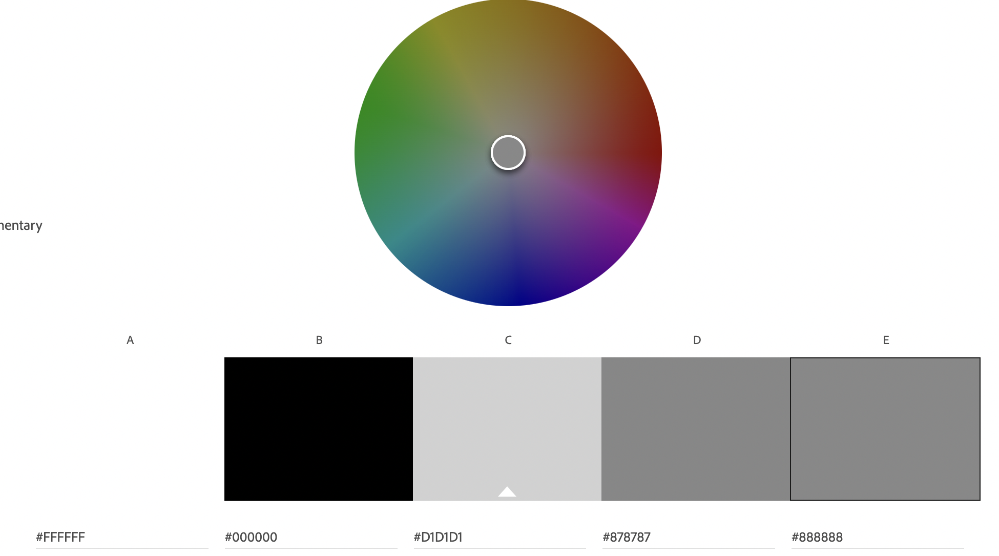
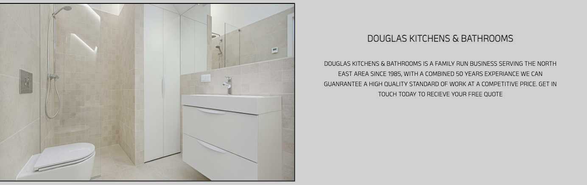

1. [Project Goals](#project-goals)
    1. [User Goals](#user-goals)
    2. [Site Owner Goals](#site-owner-goals)
2. [User Experience](#user-experience)
    1. [Target Audience](#target-audience)
    2. [User Requirements and Expectations](#user-requrements-and-expectations)
    3. [User Stories](#user-stories)
3. [Design](#design)
    1. [Design Choices](#design-choices)
    2. [Colours](#colours)
    3. [Fonts](#fonts)
    4. [Structure](#structure)
    5. [Wireframes](#wireframes)
4. [Technologies Used](#technologies-used)
    1. [Languages](#languages)
    2. [Frameworks & Tools](#frameworks-&-tools)
5. [Features](#features)
6. [Testing](#validation)
    1. [HTML Validation](#HTML-validation)
    2. [CSS Validation](#CSS-validation)
    3. [Accessibility](#accessibility)
    4. [Performance](#performance)
    5. [Device testing](#performing-tests-on-various-devices)
    6. [Browser compatibility](#browser-compatability)
    7. [Testing user stories](#testing-user-stories)
8. [Bugs](#Bugs)
9. [Deployment](#deployment)
10. [Credits](#credits)
11. [Acknowledgements](#acknowledgements)

## Project Goals 

### User Goals
- Find a company who installs kitchens and/or bathrooms.
- See the different range of kitchens and bathrooms.
- See the quality of of work the company produce.
- Find company contact details
- Find company location

### Site Owner Goals
- Promote the company.
- Increase the sales of the company.
- Provide a way for customers to see what the company does/produces.
- Provide a way for the customers to see the companys standard of work.
- Provide a way for customers to contact the company.

## User Experience

### Target Audience
- People who are wanting a new kitchen.
- People who are wanting a new bathroom.
- People who own a house.

### User Requirements and Expectations

- Consistancy in the site so the customer quickly gets used to the site.
- A simple way to navigate around the site.
- To easily be able to find the information they are looking for.
- An eye catching site / design on different device screen sizes.
- Easy to read content.
- Easily accessible site.
- All links and functions to work as expected.
- To find the company contact details.
- To find the company location.

### User Stories

#### First time User 
1. As a first time user, I want to see the variety of kitchens the company offer.
2. As a first time user, I want to see the variety of bathrooms the company offer.
3. As a first time user, I want to see the standard of work the company produce.
4. As a first time user, I want to know how to contact the company.
5. As a first time user, I want to know where the company is located.

#### Returning User
6. As a returning user, I want to see the new kitchen styles the company offer.
7. As a returnign user, I want to see the new bathroom styles the company offer.
8. As a returning user, I want to find the company contact number to call for any issues.
9. As a returning user, I want to leave a review following recent work completed by the company.
10. As a returning user, I want to find the companies social media pages.

#### Site Owner 
11. As the site owner, I want the customer to learn about the company.
12. As the site owner, I want the customer to see what we offer.
13. As the site owner, I want the customers to know where we are located.
14. As the site owner, I want the customers to be able to contact us.
15. As the site owner, I want the customers to be able to give us feedback on our work.

## Design

### Design Choices
The website was designed to look modern and stylish while keeping the site simple to naviagte for the customer, the design replicates the companies sleek kitchen and bathroom designs they offer. 

### Colour
The monochromatic colour scheme of black, white and different shades of grey was chosen to give a modern look to the webpage. The darker colouring also allows the images of the companies installed work really stand out. When choosing the site colours I used Adobe Color to confirm the contrast between the colours was right.

### Fonts
The heading font chosen for throughout the site is anek telugu from Google Fonts, the reasons I chose this font is because it is very clear and easy to read. The chosen font also has a stylish modern look which links in with the design of the webpage. As a back up I chose sans-serif if the anek telugu is unavailable.

### Structure
The webpage has been structured in a familiar and accessible way. Once the user has reached the site they will instantly see the company name/logo in the top left corner and the navitgation menu in the top right corner, this is common throughout the site to keep the site easily operated by the user. The site is made up of four pages:
- Homepage has two sections, firstly a brief introduction to the company and secondly reasons why to choose the company.
- Our Services outlines the servies the company offer.
- Gallery shows the user an image gallery of all recent work completed by the company.
- Contact Us provides all contact information for the company and a form allowing the user to contact the company.

### Wireframes

Home

Home - Mobile

Our Services

Our Services - Mobile

Gallery

Gallery - Mobile

Contact Us

Contact Us - Mobile

## Technologies Used

### Languages
- HTML 5
- CSS 3

### Frameworks & Tools
- Git
- Gitpod
- Github
- Wireframe.cc
- Google Fonts
- Font Awsome
- Adobe Color
- Adobe Photoshop
- Google Maps
- Photo Resizer

## Features
The webpage is made up of 12 features across four pages.

### Features located on all pages
#### Navigation Bar

- The Navigation bar is consistant across all four pages.
- The design makes it very simple for users to navigate around thr webpage.
- The navigation bar is reponsive to all device screen sizes and the design changes to include a hamburger icon on screens under 950px to keep navigation easy on smaller devices.
- On devices above 950px webpages will change colour to white when the user hovers over them.
- The current page the user is on will be highlighted with grey box around page name.

#### Footer

- The Footer is consistant across all four pages.
- The user can navigate to other pages using the quick links section of the footer.
- The user can find all company contact informtion using the contact us section of the footer.
- The user can visit the company social media pages using the icon links in the footer.
- On devices above 950px all links in the footer will change colour to white when the user hovers over them.

#### User stories covered by the Navigation bar / Footer
- 4. As a first time user, I want to know how to contact the company.
- 5. As a first time user, I want to know where the company is located. 
- 8. As a returning user, I want to find the company contact number to call for any issues.
- 10. As a returning user, I want to find the companies social media pages.
- 13. As the site owner, I want the customers to know where we are located.
- 14. As the site owner, I want the customers to be able to contact us.

### Homepage Features
### Hero Image

- The homepage hero is an image of a kitchen installation completed by the company, the image is eye catching and gives the user a quick glimpse into the company.
- The homepage hero is responsive on all device screen sizes.

#### User stories covered by the Hero Image
- 3. As a first time user, I want to see the standard of work the company produce.
- 6. As a returning user, I want to see the new kitchen styles the company offer.
- 12. As the site owner, I want the customer to see what we offer.

### About Us section

- This section gives the user a brief insight into the company history.
- The text and image are reponsive on all device screens.

#### User stories covered by the About Us section
- 3. As a first time user, I want to see the standard of work the company produce.
- 11. As the site owner, I want the customer to learn about the company.

### Why Choose Us section

- This section gives the user more information about the company and reasons to choose them.
- The text and image are reponsive on all device screens.

#### User stories covered by the Why Choose Us section
- 3. As a first time user, I want to see the standard of work the company produce.
- 11. As the site owner, I want the customer to learn about the company.

#### Our Services Features
### Kitchen Installations

